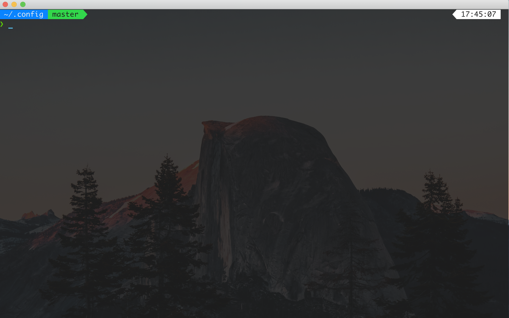
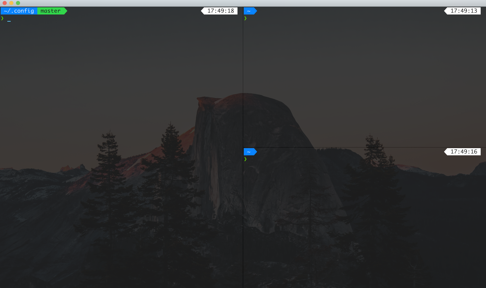

# Mac Terminal Setup
Mac 安装 [zim](https://github.com/zimfw/zimfw), 相比oh my zsh更快更容易上手
## kitty
相较于iterm2更加稳定，可以跨平台使用，配置也更容易  
 
### 安装 kitty
```
brew install kitty
```
### 配置 kitty
- Color Theme: `midnight in mojave` 
- Font: `Monaco` 
### Keyboard Shortcuts
- #### Default
| **Key**       | **Action**           |
|---------------|----------------------|
| <kbd>⌘C</kbd> | copy to clipboard    |
| <kbd>⌘V</kbd> | paste from clipboard |
| <kbd>⌘k</kbd> | scroll page up       |
| <kbd>⌘j</kbd> | scroll page down     |
| <kbd>⌘↩</kbd> | toggle_maximized     |
- #### Windows
 
**`kitty_mod`**: <kbd>^⌘</kbd> 
| **Kitty_mod** | **Action**                      |
|---------------|---------------------------------|
| <kbd>=</kbd>  | open a new window on horizontal |
| <kbd>-</kbd>  | open a new window on vertical   |
| <kbd>h</kbd>  | previous window                 |
| <kbd>l</kbd>  | next window                     |
| <kbd>x</kbd>  | close window                    |
| <kbd>1</kbd>  | first window                    |
| <kbd>2</kbd>  | second window                   |
- #### Tabs
| **Key**        | **Action**       |
|----------------|------------------|
| <kbd>⌘t</kbd>  | new tab          |
| <kbd>⌥l</kbd>  | next tab         |
| <kbd>⌥h</kbd>  | previous tab     |
| <kbd>⌘⌥w</kbd> | close tab        |
| <kbd>⌘s</kbd>  | set tab title    |
| <kbd>⌥1</kbd>  | go to first tab  |
| <kbd>⌥2</kbd>  | go to second tab |
## Neovim
 
### 安装Neovim
#### Pre-requirements
```
brew install fzf
$(brew --prefix)/opt/fzf/install
brew install the_silver_searcher
brew install ctags
pip  install pynvim
```
#### Install neovim
```
brew install neovim
```
### Keyboard Shortcuts
#### Basic Mappings
**`Mapleader`** : <kbd>Space</kbd> 
- **Normal Mode** 

| **Key**                         | **Actin**                                    |
|---------------------------------|----------------------------------------------|
| <kbd>;</kbd>                    | replace <kbd>:</kbd> enter into command mode |
| <kbd>Q</kbd>                    | exit nvim                                    |
| <kbd>^q</kbd>                   | exit all nvims                               |
| <kbd>S</kbd>                    | save the file                                |
| <kbd>Y</kbd>                    | copy till the end of the line                |
| <kbd>space</kbd> +<kbd>rc</kbd> | edit the configure of nvim                   |
| <kbd>space</kbd> +<kbd>↩</kbd>  | no highlighting                              |
| <kbd>space</kbd> +<kbd>o</kbd>  | folding                                      |

- **Visual Mode** 

| **Key**      | **Actin**                |
|--------------|--------------------------|
| <kbd>Y</kbd> | Copy to system clipboard |

- **Insert Mode**


| **Key**                         | **Actin**              |
|---------------------------------|------------------------|
| <kbd>jj</kbd>                   | enter into normal mode |
| <kbd>space</kbd> +<kbd>wq</kbd> | save the file          |

#### Cursor Movemont
- **Normal Mode**

| **Key**                    | **Actin**                       |
|----------------------------|---------------------------------|
| <kbd>space+a</kbd>         | Cursor to the start of the line |
| <kbd>space+e</kbd>         | Cursor to the end of the line   |
| <kbd>n</kbd> /<kbd>N</kbd> | Search next/previous            |

- **Insert Mode** 


| **Key**       | **Actin**                          |
|---------------|------------------------------------|
| <kbd>^a</kbd> | Move cursor to the end of the line |

- **Command Mode** 


| **Key**       | **Actin**                             |
|---------------|---------------------------------------|
| <kbd>^a</kbd> | Cursor to the start of the line       |
| <kbd>^e</kbd> | Cursor to the end of the line         |
| <kbd>^h</kbd> | Cursor to the left of the word        |
| <kbd>^l</kbd> | Cursor to the right of the word       |
| <kbd>^k</kbd> | Cursor to the previous of the command |
| <kbd>^j</kbd> | Cursor to the next of the command     |

#### Windows management

| **Key**                         | **Action**                                |
|---------------------------------|-------------------------------------------|
| <kbd>^h</kbd>                   | Move to left window                       |
| <kbd>^j</kbd>                   | Move to bottom window                     |
| <kbd>^k</kbd>                   | Move to top window                        |
| <kbd>^l</kbd>                   | Move to right window                      |
| <kbd>sd</kbd>                   | Open window at bottom                     |
| <kbd>su</kbd>                   | Open windwo at top                        |
| <kbd>sr</kbd>                   | Open windwo at right                      |
| <kbd>sl</kbd>                   | Open windwo at left                       |
| <kbd>sh</kbd>                   | Place the two screens up and down         |
| <kbd>sv</kbd>                   | Place the two screens side by side        |
| <kbd>space</kbd> +<kbd>q </kbd> | Close the window below the current window |

#### Tab management

| **Key**       | **Action**   |
|---------------|--------------|
| <kbd>tu</kbd> | new tab      |
| <kbd>th</kbd> | next tab     |
| <kbd>tl</kbd> | previous tab |

### Plugins Keybindings
#### AutoCompletion
- **COC** 


